> [!info] Kepanjangan singkatan
> QRIS = Quick Response Code Indonesian Standard.
> RRN = Retrieval Reference Number.
> RC = Response Code.
> MID = Merchant ID.
> DB = Database.
> PRD = Product Requirements Document.

> [!note] Konteks
> Draft regen bab **Requirements User Flow (FASE INI / Phase 1)** untuk [[Projects/auto-recon-QRIS/specs/PRD Auto Reconcile QRIS Tools Paydia 23 jun.docx|PRD Auto Reconcile QRIS Tools Paydia]]. Hanya cakupan fase ini. Bab lain dan FASE BERIKUTNYA tidak disentuh. Untuk direview manual [[Dion]] lalu dikasih balik versi final.

## Analisis: diagram mana yang berubah

| # | Diagram | Status | Alasan |
|---|---------|--------|--------|
| 1 | Auto Recon Engine | TETAP | User story engine tidak berubah (selain angka contoh pagination). |
| 2 | Filter Tabel Unmatch dan Dispute | TETAP | Perubahan hanya contoh pagination `10` jadi `50`, tidak ubah alur. |
| 3 | Tabel Match | TETAP | Tidak ada perubahan requirement. |
| 4 | Tabel Unmatch | **UPDATE** | Buat Transaksi sekarang set status sukses; Tolak diluar scope diatur di luar sistem; catatan bisa di status apapun. |
| 5 | Bulk Action Unmatch | **BARU** | Requirement ada di tabel Unmatch tapi flowchart-nya hilang saat reorg. Tambah aturan baru: maks 50 data sekali waktu + select all pagination aktif. |
| 6 | Modifikasi Jenis Data Settlement | **BARU** | Requirement baru di tabel Settle & Recon (T11), belum ada flowchart. Scope fase ini cuma Reguler Matched dan Tambahan Matched. |
| 7 | Tabel Decline | TETAP | Tidak ada perubahan. |
| 8 | Detail Transaksi | TETAP | Tidak ada perubahan. |
| 9 | Halaman Settle dan Recon | TETAP | Tidak ada perubahan alur. |
| 10 | Export Segregasi Data per Bank | TETAP | Tidak ada perubahan alur. |
| 11 | Export Data per Tabel | TETAP | Tidak ada perubahan. |
| 12 | Activity Log | TETAP | Tidak ada perubahan alur. |
| 13 | Alert Telegram | TETAP | Fase ini hanya kondisi proses recon lambat (kondisi gagal dispute = fase berikutnya). |
| 14 | Permission | **BARU** | Requirement baru di tabel pendukung (T12), belum ada flowchart sama sekali. |
| 15 | Sequence Diagram: Approval Flag Settle dan Buat Transaksi | TETAP | Handshake approval yang dipakai ulang oleh Buat Transaksi dan Flag Settle. |
| 16 | Sequence Diagram: Auto Recon Engine | **BARU** | Proses inti lintas sistem (Sistem Recon, File Switching, DB Paydia, Dashboard, Telegram). |
| 17 | Sequence Diagram: Tabel Unmatch Lifecycle | **BARU** | Alur On Hold sampai Flag Settle lintas Dashboard, Approval, Kibana, Transaksi QRIS MPM, DB, Settle & Recon. Beda Status masuk sebagai cabang di sini (bukan diagram terpisah). |
| 18 | Sequence Diagram: Bulk Action Unmatch | **BARU** | Batch write lintas Dashboard, Bulk Processor, DB. |
| 19 | Sequence Diagram: Settle dan Export Segregasi per Bank | **BARU** | Lintas Settle & Recon, Engine Segregasi, Master Rekening Merchant, File, Finance. |

> [!note] Kenapa sisanya tetap flowchart
> Filter, Tabel Match, Tabel Decline, Detail Transaksi, Export per Tabel, Activity Log, Modifikasi Jenis Data Settlement, dan Permission tidak dibuat sequence diagram karena alurnya single-system atau murni interaksi UI (tidak ada handshake 2+ sistem yang perlu diperjelas). Alert Telegram sudah muncul sebagai cabang di sequence Auto Recon Engine.

---

## Requirements User Flow (Fase Ini)

### [TETAP] Flowchart: Auto Recon Engine (matching acquirer)

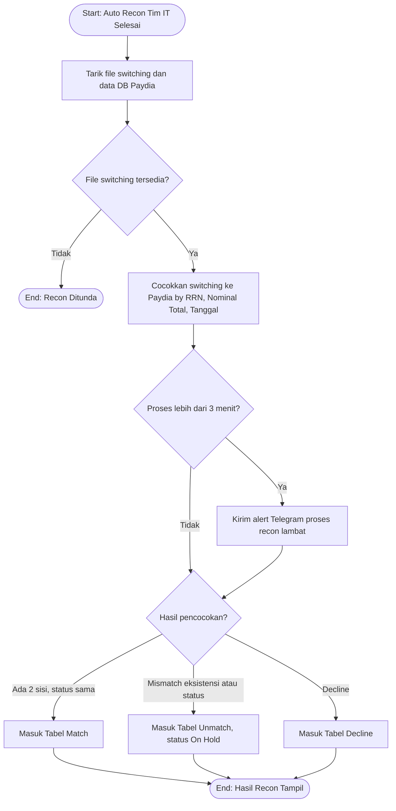
```mermaid
flowchart TD
    A(["Start: Auto Recon Tim IT Selesai"]) --> B["Tarik file switching dan data DB Paydia"]
    B --> C{"File switching tersedia?"}
    C -- Tidak --> D(["End: Recon Ditunda"])
    C -- Ya --> E["Cocokkan switching ke Paydia by RRN, Nominal Total, Tanggal"]
    E --> P{"Proses lebih dari 3 menit?"}
    P -- Ya --> Q["Kirim alert Telegram proses recon lambat"]
    P -- Tidak --> F{"Hasil pencocokan?"}
    Q --> F
    F -- "Ada 2 sisi, status sama" --> G["Masuk Tabel Match"]
    F -- "Mismatch eksistensi atau status" --> H["Masuk Tabel Unmatch, status On Hold"]
    F -- "Decline" --> I["Masuk Tabel Decline"]
    G --> K(["End: Hasil Recon Tampil"])
    H --> K
    I --> K
```

### [TETAP] Flowchart: Filter Tabel Unmatch dan Dispute

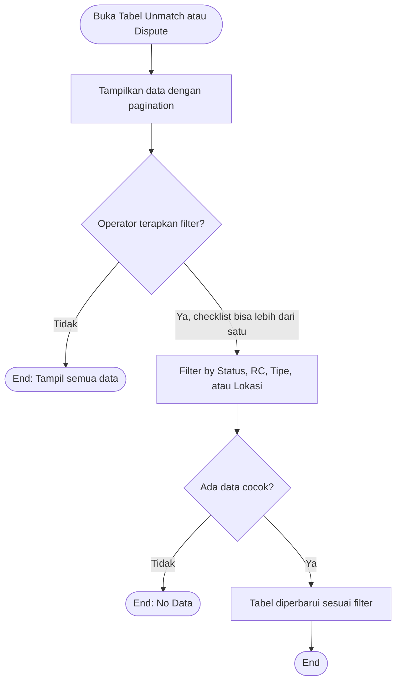
```mermaid
flowchart TD
    A(["Buka Tabel Unmatch atau Dispute"]) --> B["Tampilkan data dengan pagination"]
    B --> C{"Operator terapkan filter?"}
    C -- Tidak --> D(["End: Tampil semua data"])
    C -- "Ya, checklist bisa lebih dari satu" --> E["Filter by Status, RC, Tipe, atau Lokasi"]
    E --> F{"Ada data cocok?"}
    F -- Tidak --> G(["End: No Data"])
    F -- Ya --> H["Tabel diperbarui sesuai filter"]
    H --> I(["End"])
```

### [TETAP] Flowchart: Tabel Match (view dan detail)

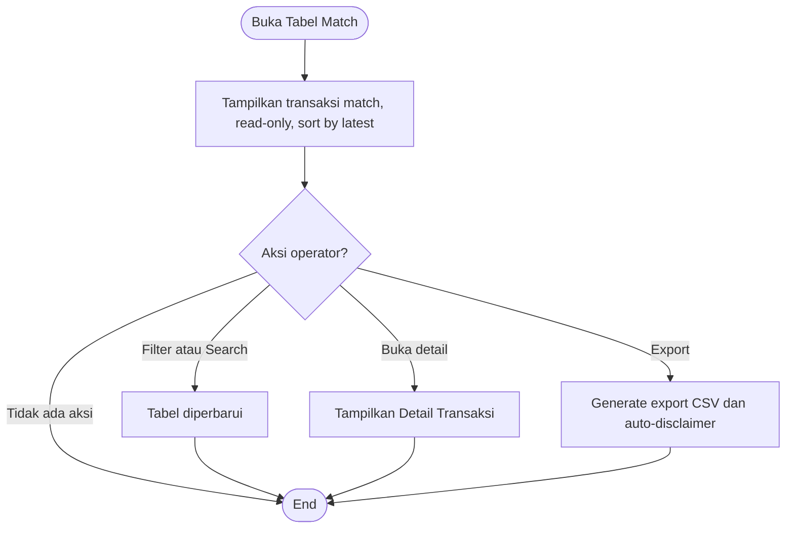
```mermaid
flowchart TD
    A(["Buka Tabel Match"]) --> B["Tampilkan transaksi match, read-only, sort by latest"]
    B --> C{"Aksi operator?"}
    C -- "Filter atau Search" --> Dx["Tabel diperbarui"]
    C -- "Buka detail" --> E["Tampilkan Detail Transaksi"]
    C -- Export --> Fx["Generate export CSV dan auto-disclaimer"]
    C -- "Tidak ada aksi" --> G(["End"])
    Dx --> G
    E --> G
    Fx --> G
```

### [UPDATE] Flowchart: Tabel Unmatch (status, buat transaksi, flag recon, flag settle, tolak)

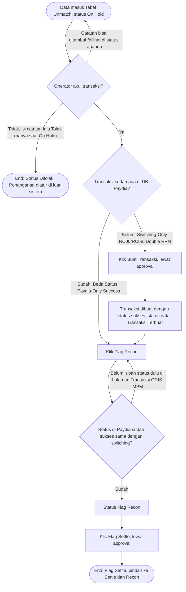
```mermaid
flowchart TD
    A(["Data masuk Tabel Unmatch, status On Hold"]) --> B{"Operator akui transaksi?"}
    B -- "Tidak, isi catatan lalu Tolak (hanya saat On Hold)" --> C(["End: Status Ditolak. Penanganan diatur di luar sistem"])
    B -- Ya --> Dd{"Transaksi sudah ada di DB Paydia?"}
    Dd -- "Belum: Switching-Only RC00/RC68, Double RRN" --> E["Klik Buat Transaksi, lewat approval"]
    E --> Fx["Transaksi dibuat dengan status sukses, status data: Transaksi Terbuat"]
    Dd -- "Sudah: Beda Status, Paydia-Only Success" --> G["Klik Flag Recon"]
    Fx --> G
    G --> Hc{"Status di Paydia sudah sukses sama dengan switching?"}
    Hc -- "Belum: ubah status dulu di halaman Transaksi QRIS MPM" --> G
    Hc -- "Sudah" --> I["Status Flag Recon"]
    I --> J["Klik Flag Settle, lewat approval"]
    J --> K(["End: Flag Settle, pindah ke Settle dan Recon"])
    B -. "Catatan bisa ditambah/dilihat di status apapun" .-> A
```

### [BARU] Flowchart: Bulk Action Unmatch (filter aksi, maks 50, select all)

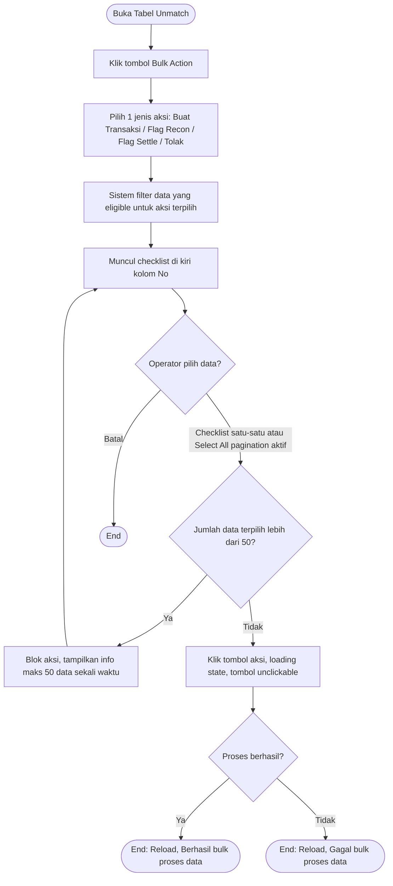
```mermaid
flowchart TD
    A(["Buka Tabel Unmatch"]) --> B["Klik tombol Bulk Action"]
    B --> C["Pilih 1 jenis aksi: Buat Transaksi / Flag Recon / Flag Settle / Tolak"]
    C --> D["Sistem filter data yang eligible untuk aksi terpilih"]
    D --> E["Muncul checklist di kiri kolom No"]
    E --> F{"Operator pilih data?"}
    F -- "Checklist satu-satu atau Select All pagination aktif" --> G{"Jumlah data terpilih lebih dari 50?"}
    F -- "Batal" --> H(["End"])
    G -- "Ya" --> Gx["Blok aksi, tampilkan info maks 50 data sekali waktu"]
    Gx --> E
    G -- "Tidak" --> I["Klik tombol aksi, loading state, tombol unclickable"]
    I --> J{"Proses berhasil?"}
    J -- Ya --> K(["End: Reload, Berhasil bulk proses data"])
    J -- Tidak --> L(["End: Reload, Gagal bulk proses data"])
```

### [BARU] Flowchart: Modifikasi Jenis Data Settlement di Settle dan Recon (fase ini)

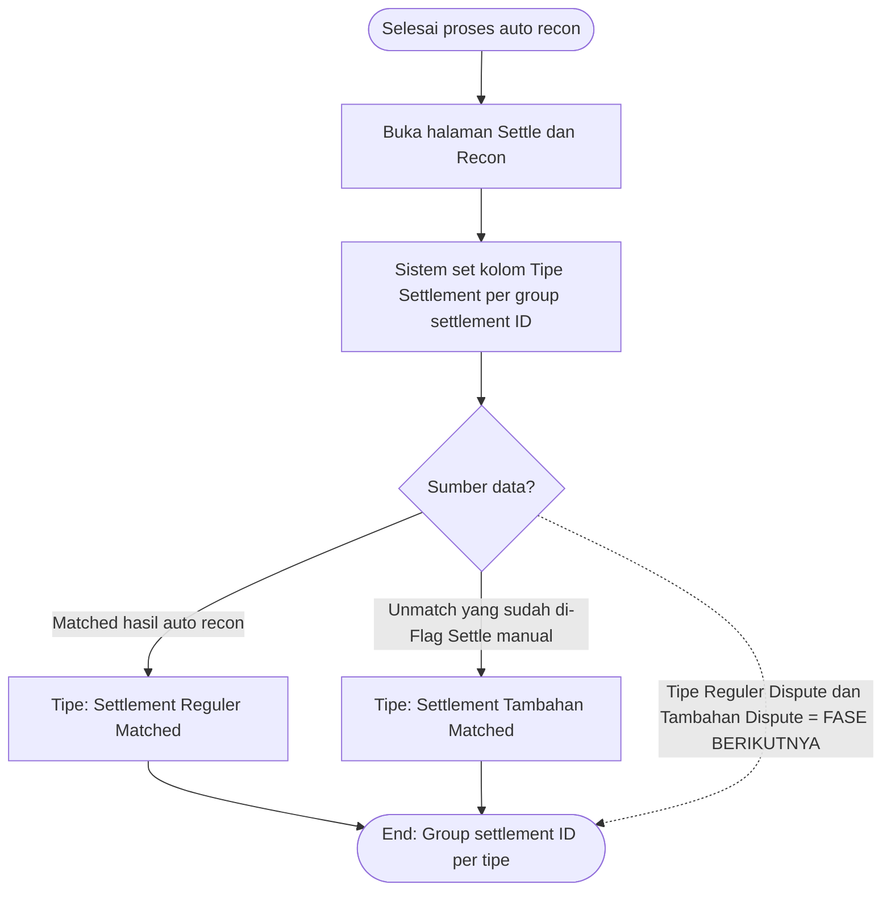
```mermaid
flowchart TD
    A(["Selesai proses auto recon"]) --> B["Buka halaman Settle dan Recon"]
    B --> C["Sistem set kolom Tipe Settlement per group settlement ID"]
    C --> D{"Sumber data?"}
    D -- "Matched hasil auto recon" --> E["Tipe: Settlement Reguler Matched"]
    D -- "Unmatch yang sudah di-Flag Settle manual" --> F["Tipe: Settlement Tambahan Matched"]
    E --> G(["End: Group settlement ID per tipe"])
    F --> G
    D -. "Tipe Reguler Dispute dan Tambahan Dispute = FASE BERIKUTNYA" .-> G
```

### [TETAP] Flowchart: Tabel Decline (view dan detail)

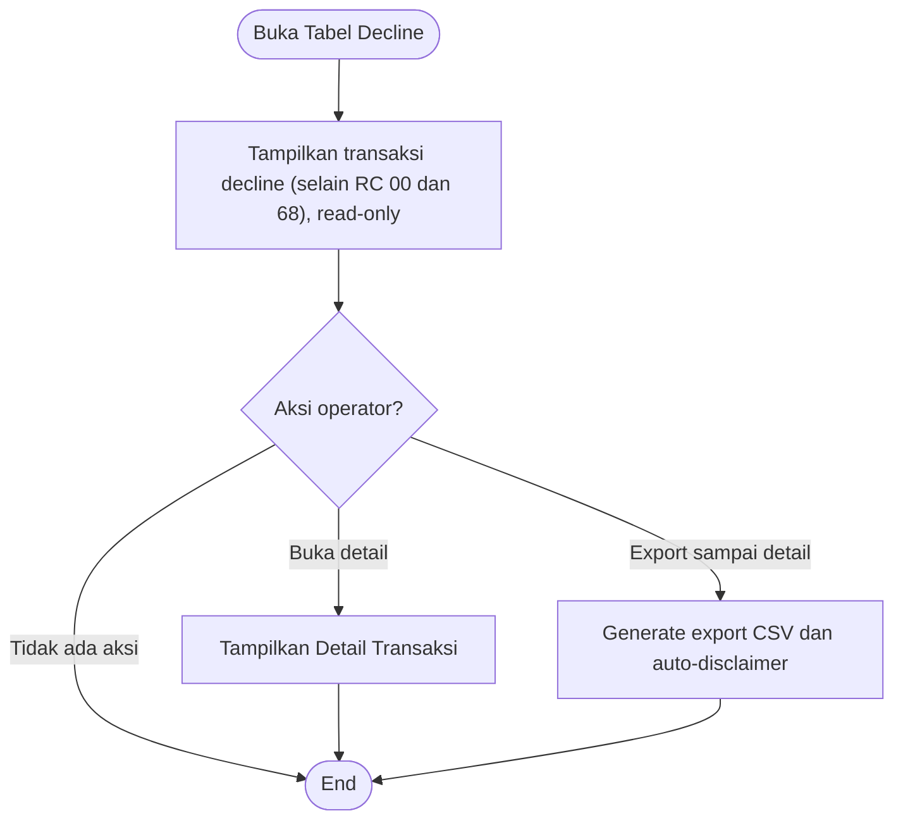
```mermaid
flowchart TD
    A(["Buka Tabel Decline"]) --> B["Tampilkan transaksi decline (selain RC 00 dan 68), read-only"]
    B --> C{"Aksi operator?"}
    C -- "Buka detail" --> Dx["Tampilkan Detail Transaksi"]
    C -- "Export sampai detail" --> E["Generate export CSV dan auto-disclaimer"]
    C -- "Tidak ada aksi" --> F(["End"])
    Dx --> F
    E --> F
```

### [TETAP] Flowchart: Detail Transaksi (berlaku di semua tabel)

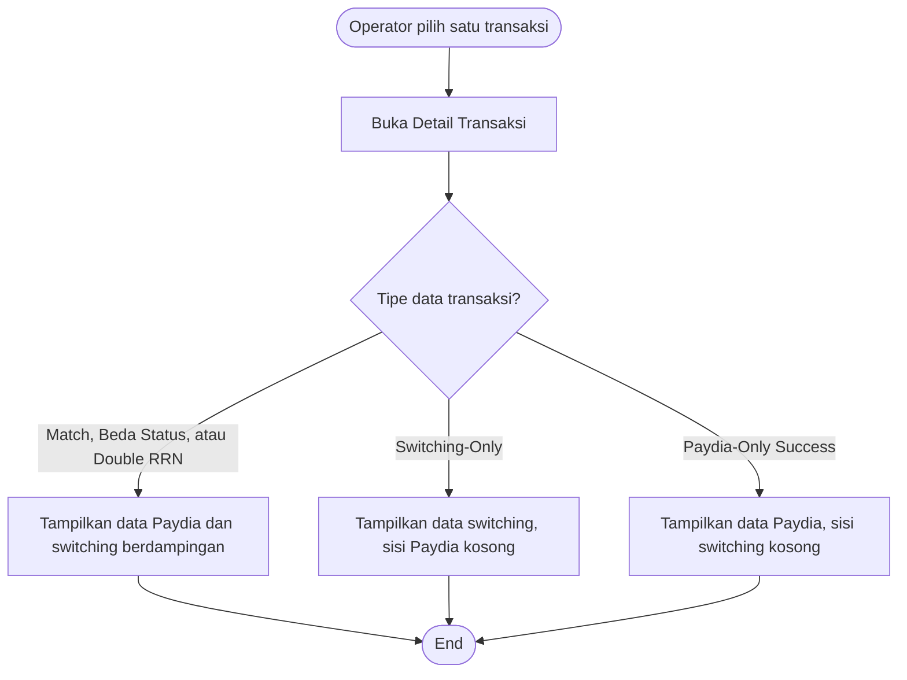
```mermaid
flowchart TD
    A(["Operator pilih satu transaksi"]) --> B["Buka Detail Transaksi"]
    B --> C{"Tipe data transaksi?"}
    C -- "Match, Beda Status, atau Double RRN" --> Dx["Tampilkan data Paydia dan switching berdampingan"]
    C -- "Switching-Only" --> E["Tampilkan data switching, sisi Paydia kosong"]
    C -- "Paydia-Only Success" --> Fx["Tampilkan data Paydia, sisi switching kosong"]
    Dx --> G(["End"])
    E --> G
    Fx --> G
```

### [TETAP] Flowchart: Halaman Settle dan Recon (settle, batalkan, manual recon fitur existing)

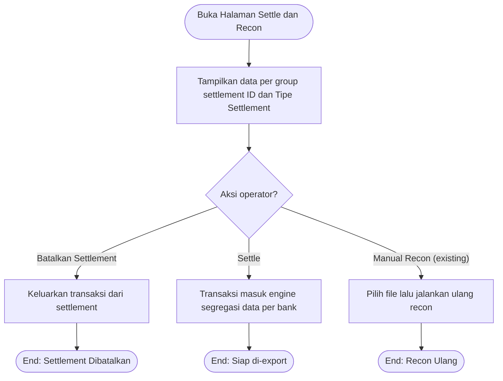
```mermaid
flowchart TD
    A(["Buka Halaman Settle dan Recon"]) --> B["Tampilkan data per group settlement ID dan Tipe Settlement"]
    B --> C{"Aksi operator?"}
    C -- "Batalkan Settlement" --> Dx["Keluarkan transaksi dari settlement"]
    Dx --> E(["End: Settlement Dibatalkan"])
    C -- Settle --> Fx["Transaksi masuk engine segregasi data per bank"]
    Fx --> G(["End: Siap di-export"])
    C -- "Manual Recon (existing)" --> H["Pilih file lalu jalankan ulang recon"]
    H --> I(["End: Recon Ulang"])
```

### [TETAP] Flowchart: Export Segregasi Data per Bank

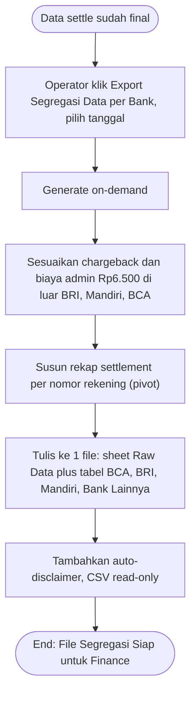
```mermaid
flowchart TD
    A(["Data settle sudah final"]) --> B["Operator klik Export Segregasi Data per Bank, pilih tanggal"]
    B --> C["Generate on-demand"]
    C --> D["Sesuaikan chargeback dan biaya admin Rp6.500 di luar BRI, Mandiri, BCA"]
    D --> E["Susun rekap settlement per nomor rekening (pivot)"]
    E --> F["Tulis ke 1 file: sheet Raw Data plus tabel BCA, BRI, Mandiri, Bank Lainnya"]
    F --> G["Tambahkan auto-disclaimer, CSV read-only"]
    G --> H(["End: File Segregasi Siap untuk Finance"])
```

### [TETAP] Flowchart: Export Data per Tabel

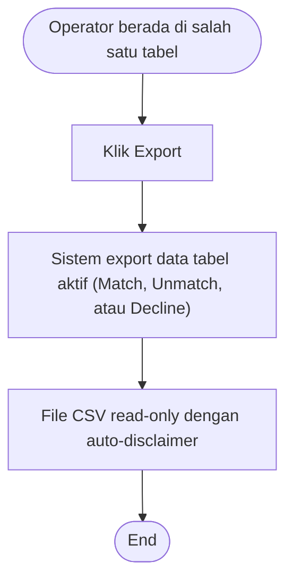
```mermaid
flowchart TD
    A(["Operator berada di salah satu tabel"]) --> B["Klik Export"]
    B --> C["Sistem export data tabel aktif (Match, Unmatch, atau Decline)"]
    C --> D["File CSV read-only dengan auto-disclaimer"]
    D --> E(["End"])
```

### [TETAP] Flowchart: Halaman Activity Log (modifikasi existing)

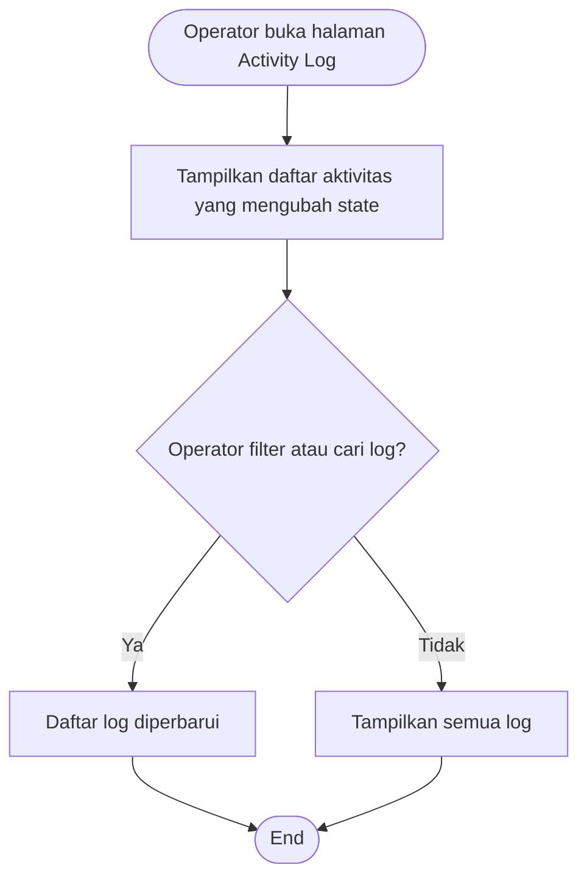
```mermaid
flowchart TD
    A(["Operator buka halaman Activity Log"]) --> B["Tampilkan daftar aktivitas yang mengubah state"]
    B --> C{"Operator filter atau cari log?"}
    C -- Ya --> Dx["Daftar log diperbarui"]
    C -- Tidak --> E["Tampilkan semua log"]
    Dx --> F(["End"])
    E --> F
```

### [TETAP] Flowchart: Alert Telegram (proses recon lambat)

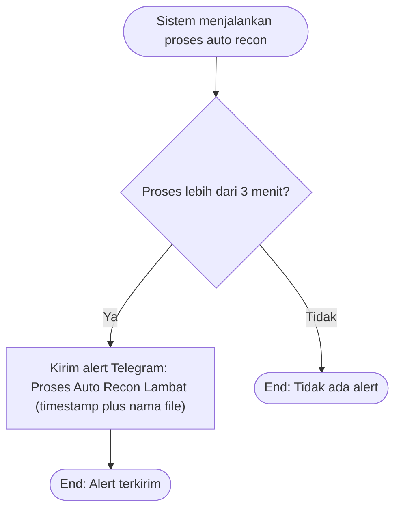
```mermaid
flowchart TD
    A(["Sistem menjalankan proses auto recon"]) --> B{"Proses lebih dari 3 menit?"}
    B -- Ya --> C["Kirim alert Telegram: Proses Auto Recon Lambat (timestamp plus nama file)"]
    B -- Tidak --> D(["End: Tidak ada alert"])
    C --> E(["End: Alert terkirim"])
```

### [BARU] Flowchart: Permission (atur hak akses fitur auto recon)

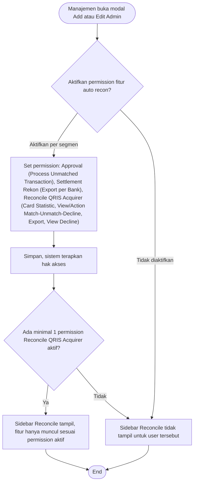
```mermaid
flowchart TD
    A(["Manajemen buka modal Add atau Edit Admin"]) --> B{"Aktifkan permission fitur auto recon?"}
    B -- "Aktifkan per segmen" --> C["Set permission: Approval (Process Unmatched Transaction), Settlement Rekon (Export per Bank), Reconcile QRIS Acquirer (Card Statistic, View/Action Match-Unmatch-Decline, Export, View Decline)"]
    C --> D["Simpan, sistem terapkan hak akses"]
    D --> E{"Ada minimal 1 permission Reconcile QRIS Acquirer aktif?"}
    E -- Ya --> F["Sidebar Reconcile tampil, fitur hanya muncul sesuai permission aktif"]
    E -- Tidak --> G["Sidebar Reconcile tidak tampil untuk user tersebut"]
    B -- "Tidak diaktifkan" --> G
    F --> H(["End"])
    G --> H
```

### [TETAP] Sequence Diagram: Approval Flag Settle dan Buat Transaksi

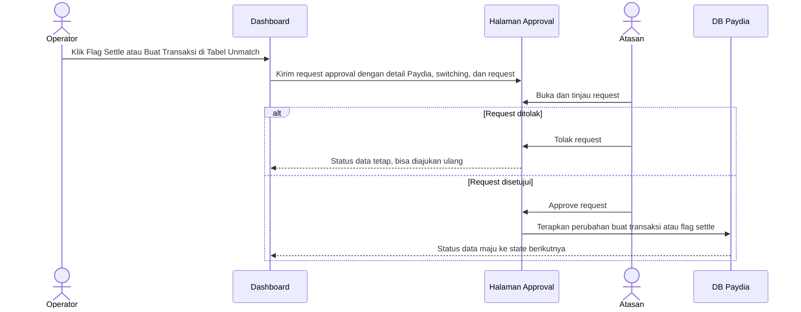
```mermaid
sequenceDiagram
    actor Operator
    participant Dashboard
    participant Approval as Halaman Approval
    actor Atasan
    participant DB as DB Paydia
    Operator->>Dashboard: Klik Flag Settle atau Buat Transaksi di Tabel Unmatch
    Dashboard->>Approval: Kirim request approval dengan detail Paydia, switching, dan request
    Atasan->>Approval: Buka dan tinjau request
    alt Request ditolak
        Atasan->>Approval: Tolak request
        Approval-->>Dashboard: Status data tetap, bisa diajukan ulang
    else Request disetujui
        Atasan->>Approval: Approve request
        Approval->>DB: Terapkan perubahan buat transaksi atau flag settle
        DB-->>Dashboard: Status data maju ke state berikutnya
    end
```

### [BARU] Sequence Diagram: Auto Recon Engine (matching acquirer)

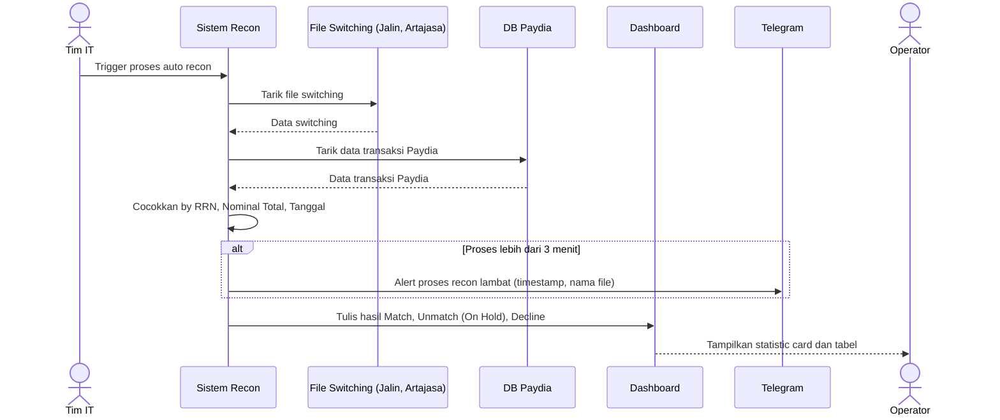
```mermaid
sequenceDiagram
    actor TimIT as Tim IT
    participant Recon as Sistem Recon
    participant Switching as File Switching (Jalin, Artajasa)
    participant DB as DB Paydia
    participant Dashboard
    participant Telegram
    actor Operator
    TimIT->>Recon: Trigger proses auto recon
    Recon->>Switching: Tarik file switching
    Switching-->>Recon: Data switching
    Recon->>DB: Tarik data transaksi Paydia
    DB-->>Recon: Data transaksi Paydia
    Recon->>Recon: Cocokkan by RRN, Nominal Total, Tanggal
    alt Proses lebih dari 3 menit
        Recon->>Telegram: Alert proses recon lambat (timestamp, nama file)
    end
    Recon->>Dashboard: Tulis hasil Match, Unmatch (On Hold), Decline
    Dashboard-->>Operator: Tampilkan statistic card dan tabel
```

### [BARU] Sequence Diagram: Tabel Unmatch Lifecycle (On Hold sampai Flag Settle)

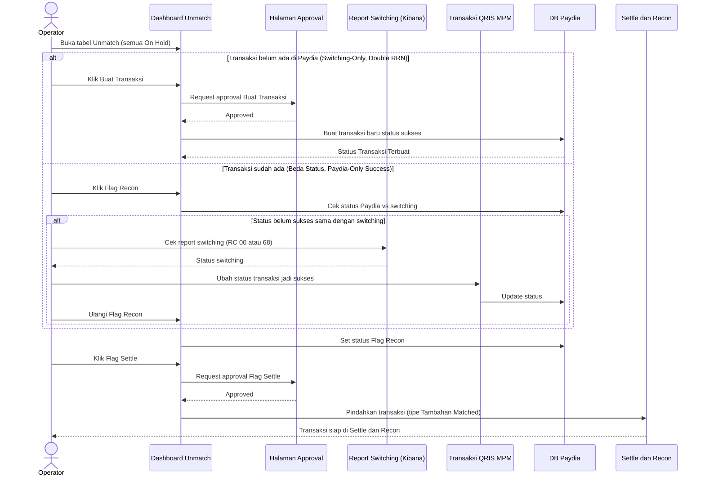
```mermaid
sequenceDiagram
    actor Operator
    participant Dashboard as Dashboard Unmatch
    participant Approval as Halaman Approval
    participant Kibana as Report Switching (Kibana)
    participant MPM as Transaksi QRIS MPM
    participant DB as DB Paydia
    participant SR as Settle dan Recon
    Operator->>Dashboard: Buka tabel Unmatch (semua On Hold)
    alt Transaksi belum ada di Paydia (Switching-Only, Double RRN)
        Operator->>Dashboard: Klik Buat Transaksi
        Dashboard->>Approval: Request approval Buat Transaksi
        Approval-->>Dashboard: Approved
        Dashboard->>DB: Buat transaksi baru status sukses
        DB-->>Dashboard: Status Transaksi Terbuat
    else Transaksi sudah ada (Beda Status, Paydia-Only Success)
        Operator->>Dashboard: Klik Flag Recon
        Dashboard->>DB: Cek status Paydia vs switching
        alt Status belum sukses sama dengan switching
            Operator->>Kibana: Cek report switching (RC 00 atau 68)
            Kibana-->>Operator: Status switching
            Operator->>MPM: Ubah status transaksi jadi sukses
            MPM->>DB: Update status
            Operator->>Dashboard: Ulangi Flag Recon
        end
    end
    Dashboard->>DB: Set status Flag Recon
    Operator->>Dashboard: Klik Flag Settle
    Dashboard->>Approval: Request approval Flag Settle
    Approval-->>Dashboard: Approved
    Dashboard->>SR: Pindahkan transaksi (tipe Tambahan Matched)
    SR-->>Operator: Transaksi siap di Settle dan Recon
```

### [BARU] Sequence Diagram: Bulk Action Unmatch

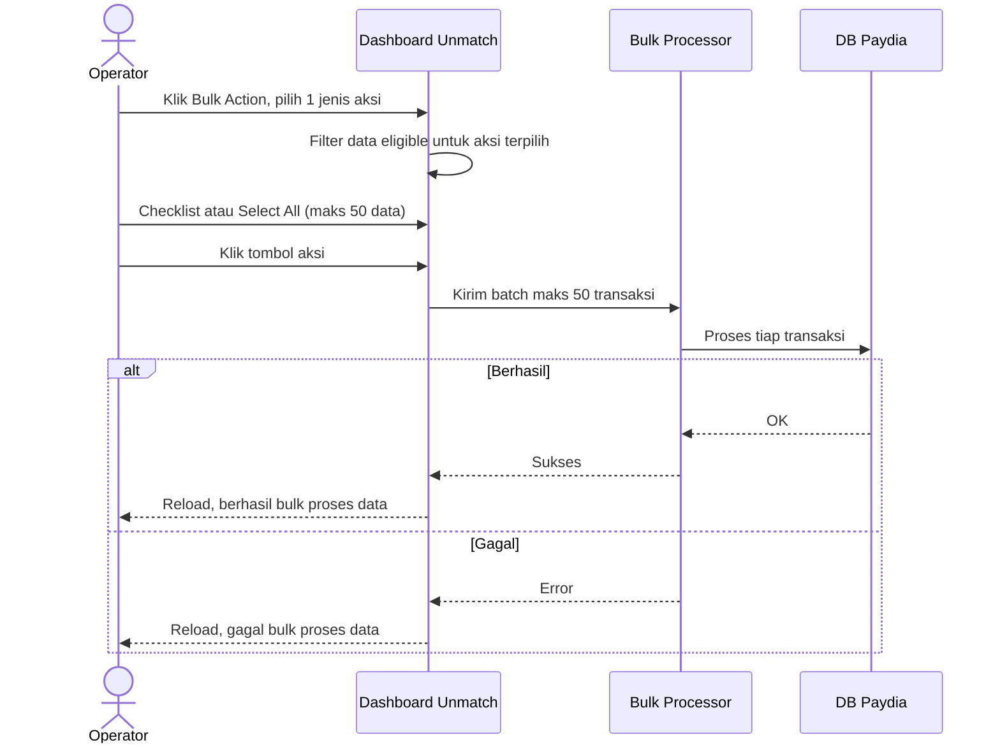
```mermaid
sequenceDiagram
    actor Operator
    participant Dashboard as Dashboard Unmatch
    participant Bulk as Bulk Processor
    participant DB as DB Paydia
    Operator->>Dashboard: Klik Bulk Action, pilih 1 jenis aksi
    Dashboard->>Dashboard: Filter data eligible untuk aksi terpilih
    Operator->>Dashboard: Checklist atau Select All (maks 50 data)
    Operator->>Dashboard: Klik tombol aksi
    Dashboard->>Bulk: Kirim batch maks 50 transaksi
    Bulk->>DB: Proses tiap transaksi
    alt Berhasil
        DB-->>Bulk: OK
        Bulk-->>Dashboard: Sukses
        Dashboard-->>Operator: Reload, berhasil bulk proses data
    else Gagal
        Bulk-->>Dashboard: Error
        Dashboard-->>Operator: Reload, gagal bulk proses data
    end
```

### [BARU] Sequence Diagram: Settle dan Export Segregasi per Bank

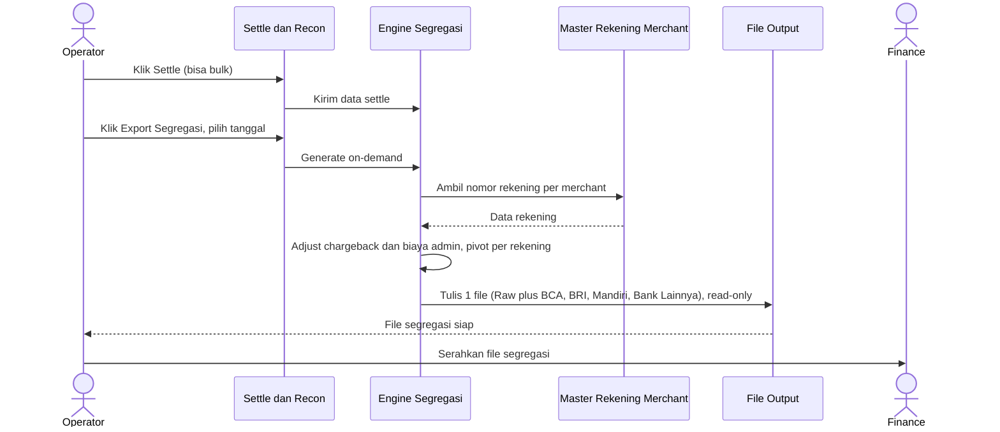
```mermaid
sequenceDiagram
    actor Operator
    participant SR as Settle dan Recon
    participant Seg as Engine Segregasi
    participant Master as Master Rekening Merchant
    participant File as File Output
    actor Finance
    Operator->>SR: Klik Settle (bisa bulk)
    SR->>Seg: Kirim data settle
    Operator->>SR: Klik Export Segregasi, pilih tanggal
    SR->>Seg: Generate on-demand
    Seg->>Master: Ambil nomor rekening per merchant
    Master-->>Seg: Data rekening
    Seg->>Seg: Adjust chargeback dan biaya admin, pivot per rekening
    Seg->>File: Tulis 1 file (Raw plus BCA, BRI, Mandiri, Bank Lainnya), read-only
    File-->>Operator: File segregasi siap
    Operator->>Finance: Serahkan file segregasi
```
